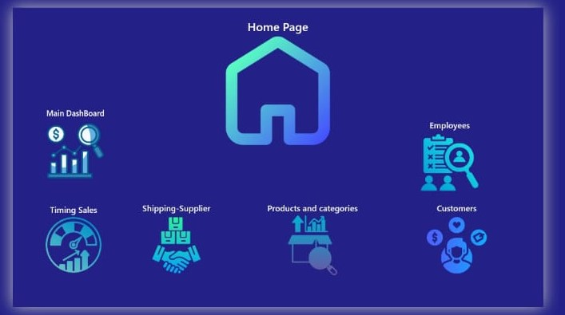
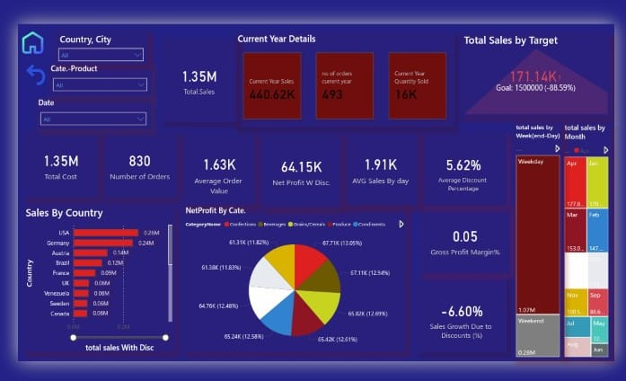
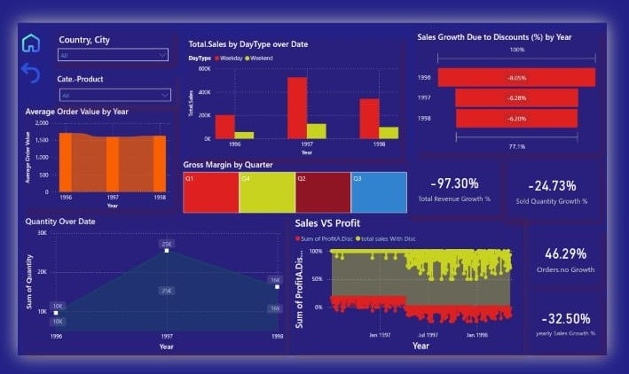
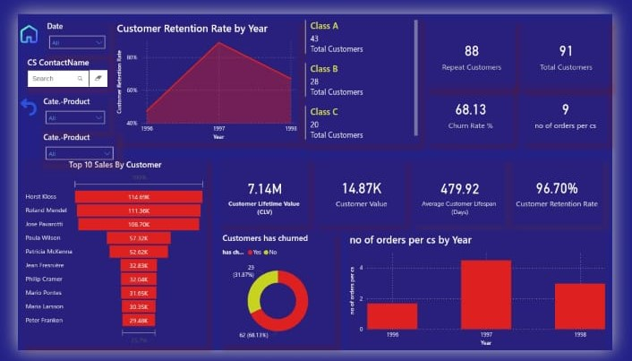
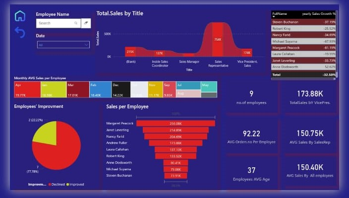
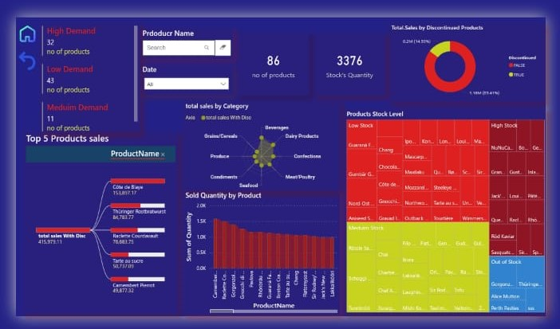
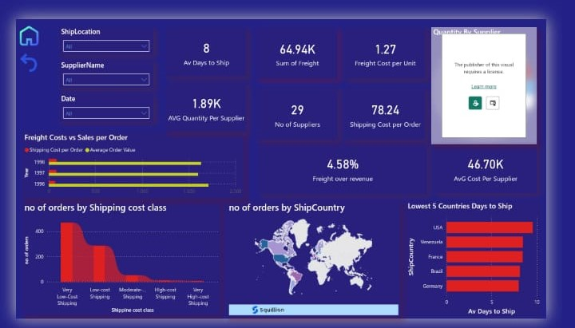

# Superstore Sales Dashboard

Power BI dashboard analyzing Superstore sales data (1996-1998) across multiple categories including beverages and dairy products, spanning countries like USA, Germany, and France.

## 📊 Overview

Interactive multi-page dashboard built with **Power BI** providing comprehensive business intelligence across shipping, sales, customers, employees, and inventory management.

## 🎯 Key Features

### Home Page
Navigation hub to 6 analytical dashboards:
- Main Dashboard
- Timing Sales
- Shipping & Supplier
- Products & Categories
- Customers
- Employees

### Main Dashboard
- **Total Sales:** 1.35M
- **Orders:** 830
- **Avg Order Value:** 1.63K
- **Net Profit:** 64.15K
- **Sales by Country:** USA leads with 0.24M
- **Net Profit by Category:** Beverages (67.12%)

### Shipping & Supplier
- **Avg Days to Ship:** 8 days
- **Total Freight:** 64.94K
- **Freight Cost/Unit:** 1.27
- **Suppliers:** 29
- **Lowest Ship Days:** USA (1 day), Venezuela (2 days)

### Customers
- **Retention Rate:** 96.70%
- **Churn Rate:** 3.17%
- **Total Customers:** 91 (88 repeat customers)
- **Top Customer:** Horst Kloss (114.60K sales)
- **Customer Lifetime Value:** 7.14M

### Products & Categories
- **High Demand:** 32 products
- **Medium Demand:** 11 products
- **Low Demand:** 43 products
- **Top Product:** Côte de Blaye (15,077.17 sales)
- Stock levels visualization by product

### Timing Sales
- **Sales Growth:** -4.2% (1997), -0.2% (1998)
- Gross margin tracking by quarter
- Quantity decline trend analysis over time

### Employees
- **Total Employees:** 9
- **Average Age:** 37
- **Top Performer:** Margaret Peacock (250.08K)
- **Sales by Title:** Sales Representatives highest

## 📸 Screenshots

  
  
  
  
  
  


## 🚀 Setup

1. **Download the repository**
   - Click the green "Code" button on GitHub
   - Select "Download ZIP"
   - Extract to your desired location

2. **Open Power BI file**
   - Navigate to the extracted folder
   - Double-click the `.pbix` file to open with Power BI Desktop

3. **Connect to data**
   - Ensure `superstore.xlsx` is in the same directory
   - If needed, update data source path in Power BI (Transform Data > Data Source Settings)

4. **Refresh and explore**
   - Click "Refresh" to load the data
   - Navigate through the dashboard pages

## 🛠️ Technologies

- **Power BI Desktop** - Dashboard creation and visualization
- **Data Source** - Excel-based Superstore dataset
- **DAX** - Calculated measures and KPIs
- **Power Query** - Data transformation

## 📁 Project Structure

```
superstore-dashboard/
├── dashboard.pbix           # Power BI dashboard file
├── superstore.xlsx          # Superstore dataset
├── README.md
└── screenshots/
    ├── home.png
    ├── main-dashboard.png
    ├── shipping.png
    ├── customers.png
    ├── products.png
    ├── timing-sales.png
    └── employees.png
```

## 📊 Data Model

**Dataset Period:** 1996-1998

**Key Entities:**
- Sales transactions
- Customers
- Products & Categories (Beverages, Dairy, etc.)
- Employees
- Suppliers
- Shipping records

**Geographical Coverage:**
- USA
- Germany
- France
- Venezuela
- Other international markets

## 🎨 Design Features

- Modern dark theme with blue/purple gradient
- Interactive filters and slicers
- Cross-page drill-through capabilities
- Dynamic KPI cards with trend indicators
- Geographical mapping
- Custom tooltips
- Icon-based navigation

## 📈 Key Metrics

- Sales performance and growth trends
- Customer retention and churn analysis
- Product demand classification
- Employee performance tracking
- Shipping efficiency metrics
- Profit margins by category

## 📄 License

MIT License - Free to use and modify

## 🤝 Contributing

Contributions welcome! Please open an issue or submit a pull request on GitHub.

---

**Repository:** [LoubnaSaad/superstore-dashboard](https://github.com/LoubnaSaad/superstore-dashboard)

**Note:** Download all files and ensure the Excel file is accessible before loading into Power BI.
